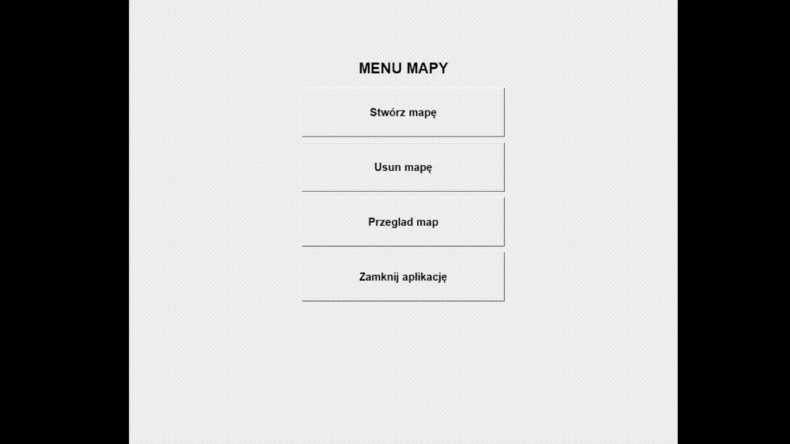

# Map Creator
 Map Creator is part of a larger group program. It was created for the purposes of a project at studies.

## Short description
 Map Creator is a part of a larger optimization program for creating the optimal robot’s route to a destination with known and unknown obstacles. Application is used to create maps with robot, his destination and known and unknown obstacles of various shapes. Program has ability to preview, delete and save maps to the .ppm and .png extension.

## Technology
* Python 3.9.7
* Tkinter
* Pillow
* Click
* Os

## Presentation of the program
These shorts videos show all the program's capabilities, such as creating, deleting, and viewing maps.

To create a map we need set the map resolution and then we can place our robot, destination point and obstacles. We have two types of obstacles, the first is obstacle which is seen by a robot in begining of program. Second obstacle is invisible until the robot is far away of obstacle. If robot is near an obstacle, it recognizes and saves the shape and placement obstacle in memory.

The next video shows the possibility of viewing and deleting created maps.

## How to run program
* open script using command prompt
* open program code in your Python IDE
